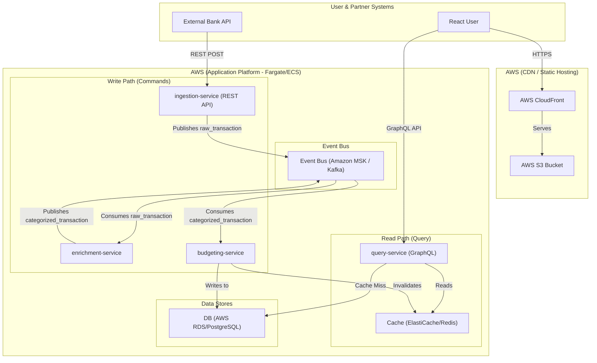

# BudgetBeam: A Real-Time Transaction Categorizer

This is a full-stack portfolio project demonstrating a modern, event-driven, cloud-native application. It ingests, enriches, and serves real-time financial transaction data.

The purpose of this project is to showcase a transition back to a hands-on, Staff-level engineering role by building a complex, end-to-end system using modern best practices.

## The Pitch

The backend is a set of Java-based microservices that simulate a FinTech app. It ingests a raw feed of bank transactions, uses a Kafka-based event pipeline to enrich and categorize them, and stores them in a "single source of truth" database.

The frontend is a React application that provides a user-facing dashboard, allowing users to view their categorized spending and manage their budgets in real-time.

## Core Architecture

This system is built on a decoupled, microservice-based architecture using the Command Query Responsibility Segregation (CQRS) and Event Sourcing patterns.

* **Write Path:** A user's action (like a transaction) is handled by an ingestion service, which publishes a "raw" event to Kafka. Downstream services consume this event, enrich it (e.g., categorization), and finally write the processed data to a PostgreSQL database.
* **Read Path:** The React frontend is served via AWS CloudFront and S3. It communicates via a GraphQL API to a dedicated `query-service`. This service reads from a Redis cache (for speed) or the PostgreSQL database (for the source of truth). This separation ensures that high-volume writes do not impact read performance.

## Service Descriptions

This monorepo contains the following services:

### Backend Services (`/services`)

* **`ingestion-service`**:
    * **Description:** A Java/Spring Boot service that exposes a REST API endpoint to receive raw transaction data from external sources (simulating bank APIs like Plaid).
    * **Responsibilities:** Validates incoming raw transaction data and publishes a `raw_transaction_posted` event to the Kafka topic.
    * **Primary Tech:** Java, Spring Web, Spring for Apache Kafka.

* **`enrichment-service`**:
    * **Description:** A Java/Spring Boot service that listens for `raw_transaction_posted` events from Kafka.
    * **Responsibilities:** Applies business logic (e.g., a rules engine or external lookup) to categorize the transaction based on merchant information. Publishes an enriched `categorized_transaction_added` event back to Kafka.
    * **Primary Tech:** Java, Spring for Apache Kafka.

* **`budgeting-service`**:
    * **Description:** A Java/Spring Boot service acting as the "write model" and the primary owner of the application's state. It listens for `categorized_transaction_added` events from Kafka.
    * **Responsibilities:** Persists the final, categorized transaction details to the PostgreSQL database. Updates the user's budget status (e.g., decrementing remaining amount for the category) in the database. Invalidates relevant entries in the Redis cache used by the `query-service`.
    * **Primary Tech:** Java, Spring Data JPA (PostgreSQL), Spring for Apache Kafka, Spring Data Redis.

* **`query-service`**:
    * **Description:** A Java/Spring Boot service acting as the "read model" backend-for-frontend (BFF). It serves the data needs of the `web-ui`.
    * **Responsibilities:** Exposes a GraphQL API for querying transaction history and budget status. Reads data primarily from the Redis cache for performance, falling back to the PostgreSQL database if the cache misses. Handles budget update *mutations* from the UI (though the core budget calculation logic resides in `budgeting-service`).
    * **Primary Tech:** Java, Spring GraphQL, Spring Data Redis, Spring Data JPA (PostgreSQL).

### Frontend UI (`/ui`)

* **`web-ui`**:
    * **Description:** A React single-page application (SPA) providing the user interface for BudgetBeam.
    * **Responsibilities:** Allows users to view their categorized transactions, visualize their budget status (e.g., using charts), and potentially set/update their budget allocations. Communicates exclusively with the `query-service` via its GraphQL API.
    * **Primary Tech:** React, React Query, TailwindCSS, Chart.js.

## Tech Stack

### Backend
* **Java 21**
* **Spring Boot 3**
* **Microservices:** Spring Web
* **Database:** Spring Data JPA, PostgreSQL (running on AWS RDS)
* **Eventing:** Spring for Apache Kafka (running on Amazon MSK)
* **API:** GraphQL (`spring-graphql`)
* **Caching:** Spring Data Redis (running on AWS ElastiCache)
* **Observability:** Micrometer, Datadog

### Frontend
* **React** (with Hooks)
* **React Query** (for data fetching, caching, and state management)
* **TailwindCSS** (for styling)
* **Chart.js** (for budget visualizations)

### Infrastructure (IaC) & Deployment
* **Docker**
* **Terraform**
* **AWS:**
    * **ECS (Fargate):** For running all containerized backend microservices.
    * **RDS (PostgreSQL):** For the primary "source of truth" database.
    * **MSK (Managed Kafka):** For the event bus.
    * **ElastiCache (Redis):** For the read-path cache.
    * **S3:** For hosting the static React build artifacts.
    * **CloudFront:** To serve the React app globally as a CDN.
    * **ALB (Application Load Balancer):** To route API traffic to the correct services.

### Development & AI
* **VS Code**
* **GitHub Copilot** (for unit test generation and boilerplate acceleration)
* **Gemini** (as an architectural "thought partner" for debugging and design)