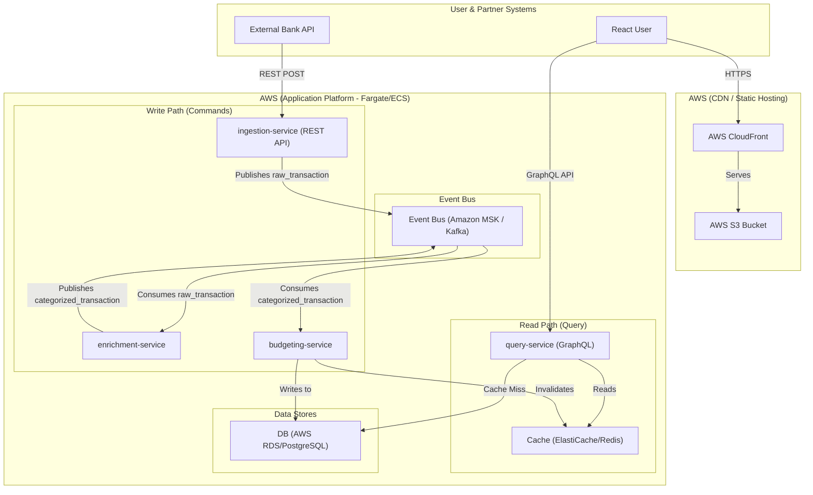

# BudgetBeam: A Real-Time Transaction Categorizer

This is a full-stack portfolio project demonstrating a modern, event-driven, cloud-native application. It ingests, enriches, and serves real-time financial transaction data.

The purpose of this project is to showcase a transition back to a hands-on, Staff-level engineering role by building a complex, end-to-end system using modern best practices.

## The Pitch

The backend is a set of Java-based microservices that simulate a FinTech app. It ingests a raw feed of bank transactions, uses a Kafka-based event pipeline to enrich and categorize them, and stores them in a "single source of truth" database.

The frontend is a React application that provides a user-facing dashboard, allowing users to view their categorized spending and manage their budgets in real-time.

## Core Architecture

This system is built on a decoupled, microservice-based architecture using the Command Query Responsibility Segregation (CQRS) and Event Sourcing patterns.

* **Write Path:** A user's action (like a transaction) is handled by an ingestion service, which publishes a "raw" event to Kafka. Downstream services consume this event, enrich it (e.g., categorization), and finally write the processed data to a PostgreSQL database.
* **Read Path:** The React frontend is served via AWS CloudFront and S3. It communicates via a GraphQL API to a dedicated `query-service`. This service reads from a Redis cache (for speed) or the PostgreSQL database (for the source of truth). This separation ensures that high-volume writes do not impact read performance.

## Tech Stack

### Backend
* **Java 21**
* **Spring Boot 3**
* **Microservices:** Spring Web
* **Database:** Spring Data JPA, PostgreSQL (running on AWS RDS)
* **Eventing:** Spring for Apache Kafka (running on Amazon MSK)
* **API:** GraphQL (`spring-graphql`)
* **Caching:** Spring Data Redis (running on AWS ElastiCache)
* **Observability:** Micrometer, Datadog

### Frontend
* **React** (with Hooks)
* **React Query** (for data fetching, caching, and state management)
* **TailwindCSS** (for styling)
* **Chart.js** (for budget visualizations)

### Infrastructure (IaC) & Deployment
* **Docker**
* **Terraform**
* **AWS:**
    * **ECS (Fargate):** For running all containerized backend microservices.
    * **RDS (PostgreSQL):** For the primary "source of truth" database.
    * **MSK (Managed Kafka):** For the event bus.
    * **ElastiCache (Redis):** For the read-path cache.
    * **S3:** For hosting the static React build artifacts.
    * **CloudFront:** To serve the React app globally as a CDN.
    * **ALB (Application Load Balancer):** To route API traffic to the correct services.

### Development & AI
* **VS Code**
* **GitHub Copilot** (for unit test generation and boilerplate acceleration)
* **Gemini** (as an architectural "thought partner" for debugging and design)